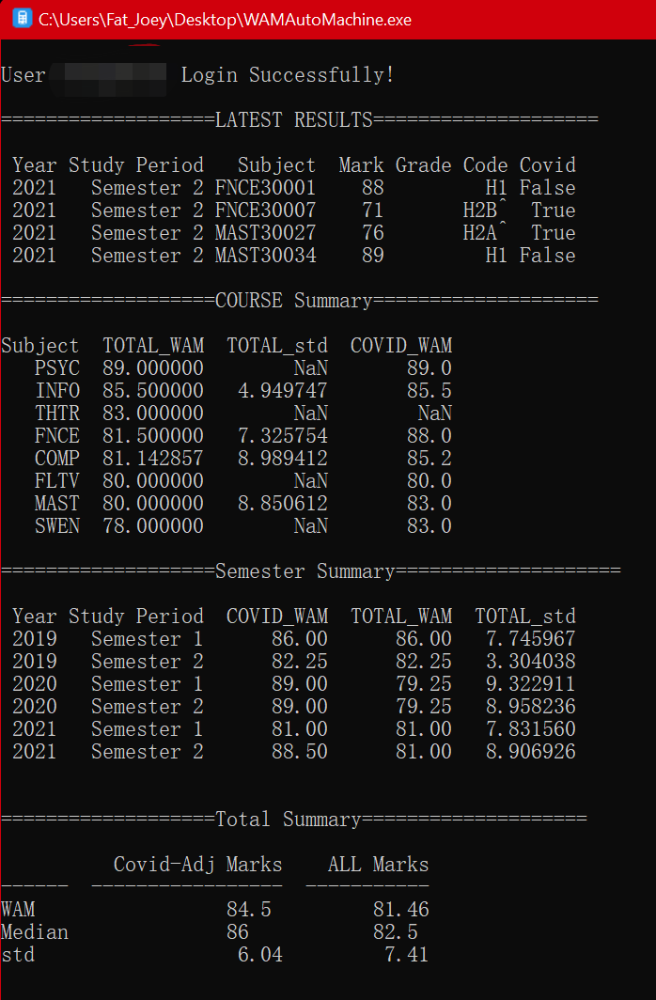
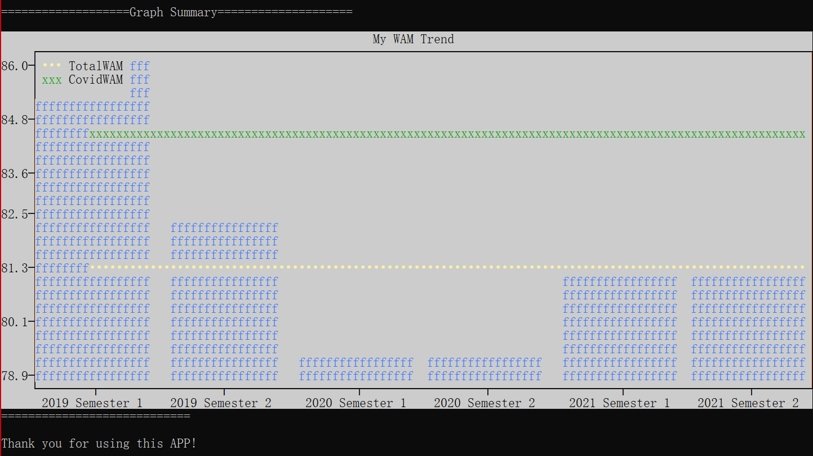

# WAMAutoMachine
Get Latest WAM / Calculate Standard(COVID-19) WAM in one Click.

Since the University provides students options to include all of their results(including COVID WAM^) in their final year's wam calculation, it is important to know which option is better for you.
Therefore, I wrote this small program that aotumatically calculate your wam with/without covid-19 wam boost.

## Functions:
1. Retrive latest course results
2. Comparisons between Standard WAM and Covid-Affected WAM.  More Info: (https://students.unimelb.edu.au/your-course/manage-your-course/exams-assessments-and-results/results-and-academic-statements/wam/wam-adjustments-2021)
3. Trending Analysis Plot

## How To Use:
Windows:
- Download executable file from "release" section.
- Designed for Windows and Mac users.
-- Enter Your Uni Account UserName + Password (Will not be displayed but it still enters)
- Build in Windows: use terminal 'auto-py-to-exe' to build
Mac:
Haven't realease yet, but you can still run it.
- Make sure you know how to use python (install packages, etc)
- python3 WAMCalculator.py

## Common Issues:
- Press Enter if you get stuck.
- For Privacy issues the password will not be displayed but it still works.
- If open the app and nothing happens, press Enter for a few times.

## Your Login information is only used to login into school's website. Your Information will NOT be gathered or shared with any other use.

