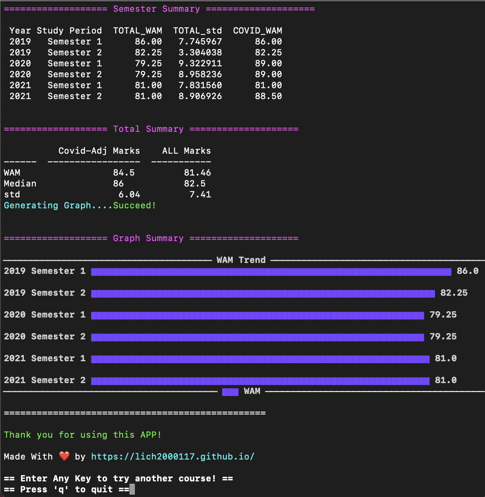
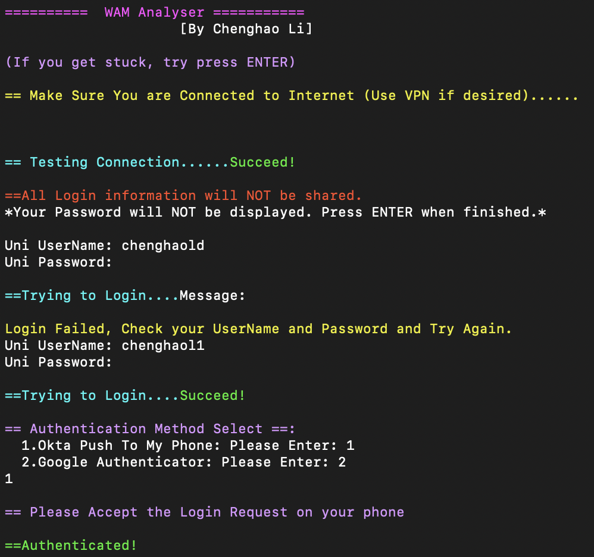

# WAMAnalyser

##### Table of Contents  
1. [What is this?](#What-is-this?)  
2. [Functionality](#Functionality)  
3. [How to Use](#How-to-Use)  
4. [Uninstall](#Uninstall)  
5. [Known Issues](#Known-Issues)  
6. [Developer Notes](#Developer-Notes)  
7. [Uninstall](#Uninstall)  


---
### Your Login information is only used to login into school's website. Your Information will NOT be gathered or shared with any other use.
---

## What is this?
Get Latest WAM / COVID-19 WAM and bunch of Analysis based on your subject group, semester etc.

Since the University provides students options to include all of their results(including COVID WAM^) in their final year's wam calculation, it is important to know which option is better for you.
Therefore, I wrote this small program that aotumatically calculate your wam with/without covid-19 wam boost.

## Functionality:
1. Login into unimelb website with 2-step verification (Okta and Google Authenticator)
1. Retrive latest course results
2. Comparisons between Standard WAM and Covid-Affected WAM.  More Info: (https://students.unimelb.edu.au/your-course/manage-your-course/exams-assessments-and-results/results-and-academic-statements/wam/wam-adjustments-2021)
3. Analysis Plot based on Subjects, Course, Semester

Overall Statistics       |  Analysis Plot
:-------------------------:|:-------------------------:
  |  

|Login Detail|
|:-------------------------:|
||


## How to Use:

#### Mac/Linux User:
1. Make sure you have [Python 3.8+](https://www.python.org/) Installed.
2. Copy "WAMAnalyser.py" to Desktop.
3. Open "Terminal" app.
4. Enter the following Codes in terminal:
5. ```cd Desktop```
6. ```pip3 install selenium webdriver_manager tabulate plotext lxml```   ## if you can't run this step, it means you don't have a valid [Python 3.8+](https://www.python.org/) installed
7. ```python3 WAMAnalyser.py```
8. Follow Instructions in Terminal.


#### Windows:
1. Make sure you have [Python 3.8+](https://www.python.org/) Installed.
2. Copy "WAMAnalyser.py" to Desktop.
3. Right Click to the Desktop and "Open in Terminal"
4. Enter following lines in Terminal: 
5. ```pip install selenium webdriver_manager tabulate plotext lxml```   ##If it doesn't work, it means you don't have a valid [Python 3.8+](https://www.python.org/) Installed.
6. ```python WAMAnalyser.py```
7. Follow Instructions in Terminal.

## Uninstall:
#### Mac/Linux User:
1. ```pip3 remove selenium webdriver_manager tabulate plotext lxml```
Then Delete the downloaded files.
2. #### Windows:
1. ```pip remove selenium webdriver_manager tabulate plotext lxml```
2. Then Delete the downloaded files.
## Known Issues:
- Login might fail if you have bad internet connections.
- For Privacy issues the password will not be displayed but it still works.


## Developer Notes: 
1. Always use XPATH and javascript click instead of simple .click() as some of the button may not be visible.
- XPATH: always use XPATH without dynamic id in it, for example, we don't want id="input17" as it is a dynamic field
- Solution: simply delete this field in the browser's "inspect" tab and copy XPATH again to get one without dynamic ID.
2. Use JavaScript Click rather than .click()
    ```
    element = driver.find(xxxx) 
    driver.execute_script("arguments[0].click();", element)
    ```
3. Build in Windows: use terminal 'auto-py-to-exe' to build, pip can install this package
